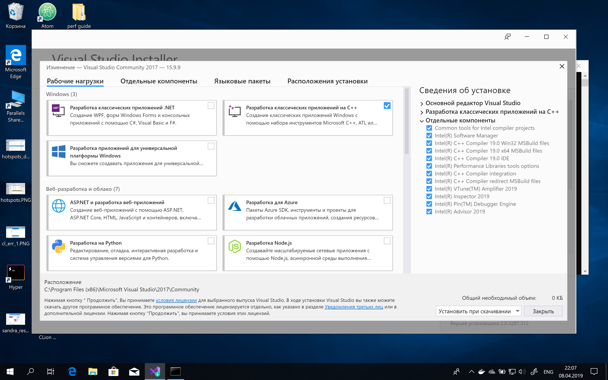
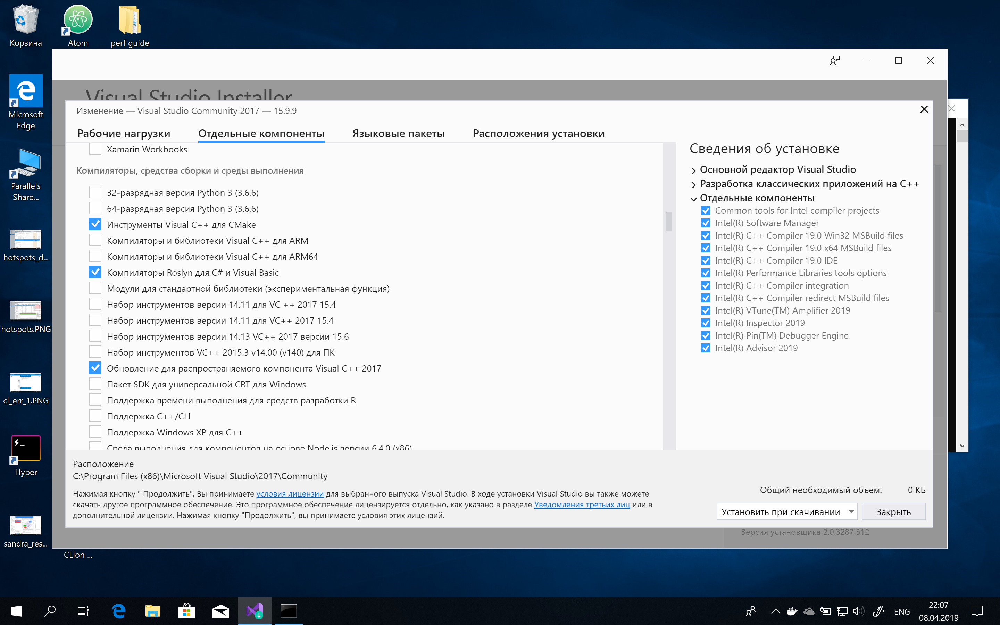
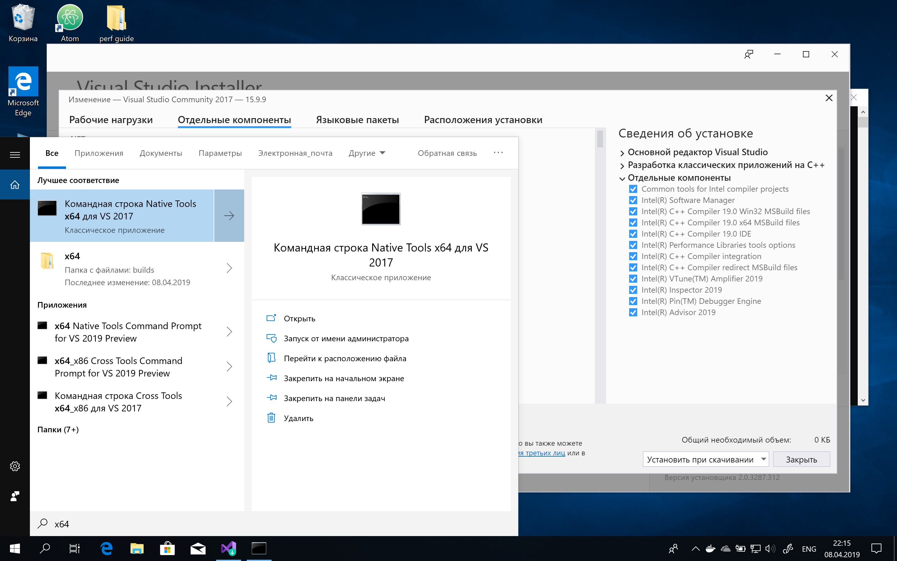
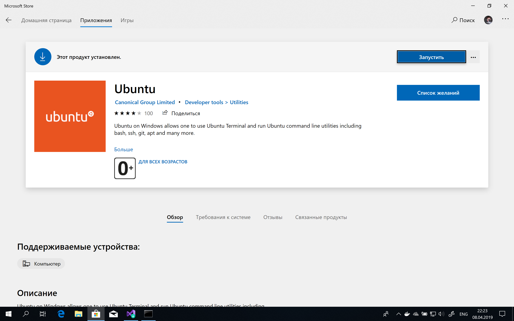

# Установка инструментов

  - [Windows](#Windows)
  - [Ubuntu](#Ubuntu)
  - [macOS](#macOS)

------------

## Windows

### Visual Studio 2017

1. Скачайте и установите [Visual Studio](https://visualstudio.microsoft.com/ru/). Удостоверьтесь, что выбраны компоненты "Разработка классических приложений на C++" и "Инструменты Visual C++ для CMake".
   
   
1. Скачайте и установите [Git](https://git-scm.com).
1. После установки в меню Пуск появится пункт "Командная строка Native Tools x64 для VS 2017".
   
1. Склонируйте репозиторий и перейдите в него
   ```
   $ cd c:/Users/user/projects/
   $ git clone https://github.com/your-id/devtools-course-practice.git
   $ cd devtools-course-practice
   ```
1. Запустите тесты
   ```
   $ ctest -VV -S devtools_test.cmake
   ```

### Windows Subsystem for Linux

На Windows 10 есть возможность получить окружение, близкое к Linux.

1. Включите Windows Subsystem for Linux.
   [Инструкция](https://docs.microsoft.com/en-us/windows/wsl/install-win10)
1. Перейдите в Windows Store и скачайте приложение Ubuntu
   
1. Запустите приложение Ubuntu и выполните предложенные инструкции по установке
1. Следуйте инструкциям для Ubuntu

## Ubuntu

1. Запустите терминал и выполните команду
   ```
   $ sudo apt-get update
   $ sudo apt-get install build-essential cmake git
   ```
1. Создайте каталог для проекта и склонируйте репозиторий
   ```
   $ mkdir ~/projects
   $ cd ~/projects
   $ git clone https://github.com/your-id/devtools-course-practice.git
   $ cd devtools-course-practice
   ```
1. Запустите тесты
   ```
   $ ctest -VV -S devtools_test.cmake
   ```

## macOS

1. Откройте Terminal.app
1. Установите инструменты командной строки XCode
   ```
   $ xcode-select --install
   ```
1. Установите Homebrew. [Инструкция](https://brew.sh/index_ru)
1. Выполните команду
   ```
   $ brew install cmake
   ```
1. Создайте каталог для проекта и склонируйте репозиторий
   ```
   $ mkdir ~/projects
   $ cd ~/projects
   $ git clone https://github.com/your-id/devtools-course-practice.git
   $ cd devtools-course-practice
   ```
1. Запустите тесты
   ```
   $ ctest -VV -S devtools_test.cmake
   ```
